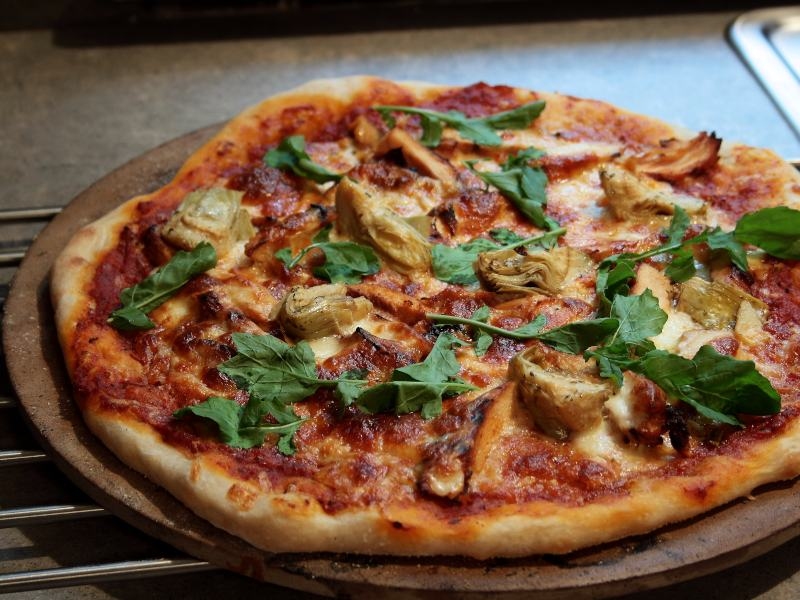

Today I ordered a pizza.  I took the car and went to the restaurant to grab the order, instead of waiting for the delivery guy.  It's something I do from time to time.  I payed for the pizza and walked to the car to get back home.

Then, this guy approached me, a total stranger.  He had an unusual request to make.  He asked me to give him a ride, so he could try to catch a bus somewhere else (the restaurant is located in a neighborhood not well served by bus lines).  It was relatively late, so maybe he wouldn't be able to catch the last bus if he waited for too long in the restaurant's vicinities.

Now, don't get me wrong, I really wished to help the guy, but there's this little thing called fear.  I feared for my own security, who wouldn't?  Also, I have a wife, and a daughter; and the ride, this seemingly harmless act of kindness, could turn their lives upside down.  I denied his plea for help, as politely as I could, and entered the car.

But, it turns out I could see from the windshield that he simply stared at the empty avenue, in hopes of another car passing around.  He was clearly telling the truth.  Either way, I couldn't take the risk.  No way I would give him this ride.

So, in a glimpse, I opened the ashtray, and there I found some money.  A good amount, enough for him to take a cab.  I opened the window and called him.  He approached the car and I stretched my arm, "Does it help if you take a cab?".  He thanked me a lot and ran to the restaurant, to use their phone to call the cab service.  I was relieved.

"Pizza: Grilled chicken, artichoke hearts, and arugula" by ecospc is licensed under CC BY-NC 2.0. To view a copy of this license, visit [https://creativecommons.org/licenses/by-nc/2.0/?ref=openverse](https://creativecommons.org/licenses/by-nc/2.0/?ref=openverse).
